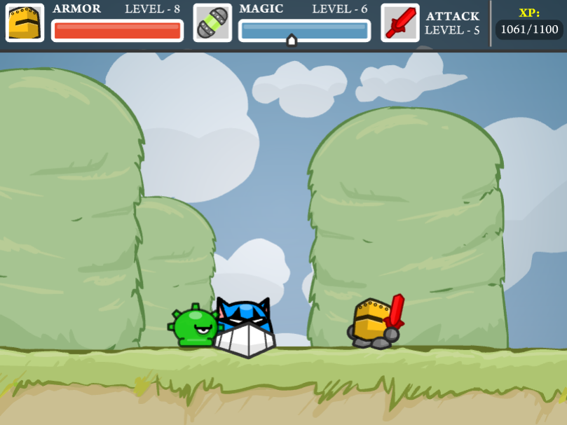

# Chibi Knight

[Chibi Knight](https://www.crazygames.com/game/chibi-knight) is a free online game where a knight must defeat three beasts to save the kingdom. It is a 2D RPG with platformer combat and exploration. I think it is a good example of the genre of game we are making and we can learn from it. It takes about 45 minutes to complete and I would recommend trying it for just a few minutes at least.

## Combat

 - Random encounters with different types of roaming enemies.
 - Walking into an enemy starts a fight and changes the game from top down 2D explorer to a small platformer level.
 - Combat is simple - the player can swing the sword for free or spend mana to cast spells.
 - Defeated enemies give XP and drop either mana or health that can be picked up.
 - Death is not punished - the player returns to the starting place and must walk back to where they died to resume playing.

## Progression

 - Three stats to be upgraded (attack, magic, armor).
 - On leveling up, XP can be spent to buy the next level in one of the three stats.
 - There is also an option to skip leveling up, allowing the player to save XP and spend it on a different stat next time they level up.

## Map
 - Open world map.
 - Some areas were locked until certain enemies were defeated/special keys were obtained.
 - Signs display text when walked in front of and give hints on where to go, who to talk to what items are needed to progress.
 

## Items
 - Items given let the player walk on water to reach new areas, chop down trees to get wood for a side quest, and keys open doors.
 - Items can be found through exploration and helping NPCs.

## Magic
 - Five wizards are spread out through the game and each of them teaches the player a different spell.
 - Some require a mini quest, traded item, or finding them was a challenge.

## Boss Fights
 - Three bosses spread out the map.
 - Some of them could only be reached after passing a narrow corridor blocked off by enemies - the player cannot reach the boss until they defeat all the enemies in the way, and dying resets that progress because enemies respawn.
 - Each boss had unique mechanics (throw up bombs that come down and the player can dodge/take cover under platforms, throw an axe then becomes vulnerable while it slowly retrieves the axe etc).

## Scoring

 - There is no scoring during the game but there are summary stats displayed at game completion.

 ## Additional things we could do
 - If the player would get more health when they are already full, they could get extra XP/score/stat boost instead.
 - Fast travel to previously discovered regions - it is tedious to walk everywhere, especially through the maze-like dungeon.