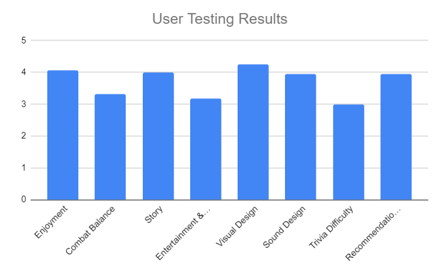

*Bar chart of numerical mean score out of five*

Users enjoyed the following aspects:
 - Open world
 - Music, sound design
 - Art
 - UI
 - Puzzles
 - Story

# Combat
 - Combat is not difficult enough - this game is designed for a younger audience so no changes are needed in this regard.
 - Controls were unintuitive - updated controls to match industry standard and included info page accessible by ressing F1 in-game.

# Story
 - There were positive responses to the writing, lore, and story.

# Bugs
 - Walk through wall glitch - under development.

# Additional comments
 - Request for documentation - a PDF titled User-Documentation is now available in the repository.
 - Too much randomisation in the alcohol dungeon - users founds controls being scrambled every 4 seconds to be too annoying. Scrambling now occurs once per level.